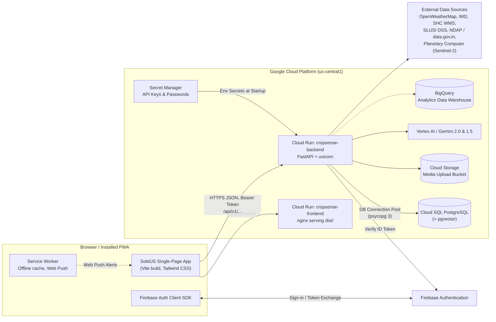
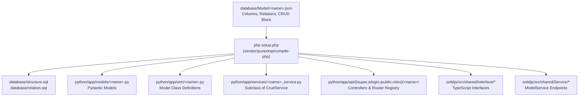
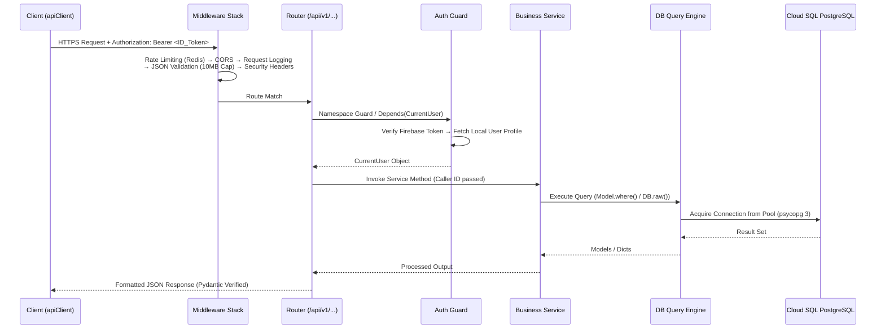
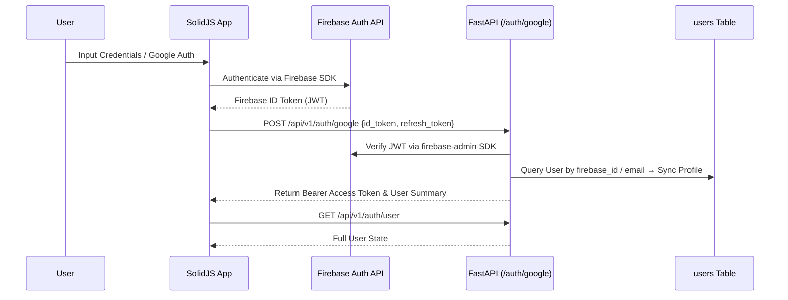
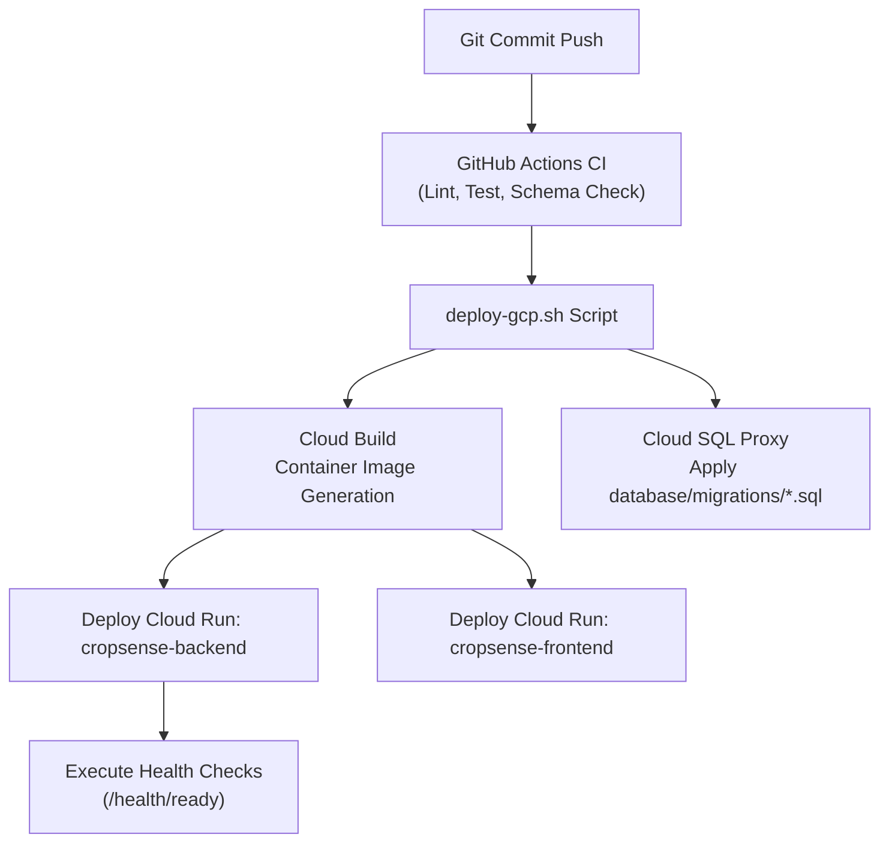

### CropSense AI — System Design
*Last updated: 2026-09-28 (branch feat/livestock-assistant-services-i18n).*

This document explains how the whole CropSense AI system fits together: architecture layers, end-to-end request lifecycle, database persistence and ownership enforcement, code generation framework, AI infrastructure, background jobs, deployment pipelines, and observability. 

Companion documentation:
| Document | Covers |
| ------ | ------ |
| [BACKEND-v2.md](BACKEND-v2.md) | Every FastAPI module: core layer, all 51 /api/v1 routers (394 endpoints), services, agents, jobs, and security guards |
| [FRONTEND-v2.md](FRONTEND-v2.md) | All 45 SolidJS routes, request/response contracts, page handoffs, browser storage policies, and state machine integrations |
| [DATA_MODEL-v2.md](DATA_MODEL-v2.md) | All 58 tables, ownership rules, relational diagrams, schema generator, and Cloud SQL migration pipelines |
| [IMPROVEMENTS.md](IMPROVEMENTS.md) | Prioritized software fix roadmap (P0 security → P3 clean-up) |
| [SETUP.md](SETUP.md) | Local development, container sandbox, and GCP Cloud Run setup |

--------------------------------------------------------------------------------

#### 1. What the System Does
CropSense AI is a mobile-first digital public infrastructure application built for Indian smallholder farmers, buyers, service providers, and regional agricultural officials. Key functional domains include:

*   **Farm & Crop Management**: Digital farm registration, plot boundary mapping, crop life-cycle tracking (including inter-cropping / supporting crops), expense logging, growth stage milestones, Gemini-powered annual strategy generation, and yield forecasting.
*   **Livestock Intelligence**: Herd records, vaccination schedules and reminders, breeding logs and offspring tracking, nutrition/diet planning, ROI predictions, veterinary directory, and remote AI symptom analysis.
*   **Soil, Weather & Pests**: Soil Health Card (SHC) and SLUSI microwatershed data integration, soil lab test processing, fertilizer recommendations, OpenWeatherMap/IMD failover forecasts, severe weather alerts, and pest/disease identifying models.
*   **Marketplace & Supply Logistics**: Crop harvest listings, buyer interest logging, advance pre-harvest bookings with escrow milestone payments and quality verification, livestock trading, transport logistics booking, and price/demand predictive analytics.
*   **Multimodal AI Utilities**: Floating voice/text assistant and full-page chat with Indian language support (15 languages) for human-in-the-loop form pre-filling, Gemini Vision crop diagnostics, Sentinel-2 satellite field health telemetry (NDVI, NDMI, NDRE), and automated executive reporting.
*   **Platform & Security Architecture**: Firebase Authentication with local RBAC scoping, PWA offline capabilities, Web Push & in-app notifications, and strict per-user AI usage quota enforcement.

User roles: **farmer** (primary user), **buyer**, **service_provider** (veterinarians, transporters, equipment owners), and **admin**.

--------------------------------------------------------------------------------

#### 2. High-Level System Architecture



**Services Deployment Specification:**
| Container Service | Source Directory | Runtime Environment | Resource Sizing (`deploy-gcp.sh`) |
| ------ | ------ | ------ | ------ |
| `cropsense-backend` | `python/` (`python/Dockerfile`) | FastAPI / Python 3.12 on Cloud Run, Port 8000, Cloud SQL Unix Socket | 2 vCPU, 2 GiB RAM, Min 1 / Max 10 instances |
| `cropsense-frontend` | `solidjs/` (`solidjs/Dockerfile`) | Nginx 1.25 Alpine serving static assets, Port 8080 | 1 vCPU, 256 MiB RAM, Min 0 / Max 5 instances |

*Note on cold starts:* `cropsense-backend` maintains `min-instances=1` in production because model initialization (Pydantic models, PyTorch, satellite processing libraries) exceeds client sign-in HTTP timeouts.

--------------------------------------------------------------------------------

#### 3. Repository Structure

```
python/                 FastAPI Backend Root
  app/main.py           Application entry point: middleware, routing, schedulers
  app/core/             DB query engine, Firebase auth, ownership checks, rate limiting
  app/api/isuper/       GENERATED Admin CRUD controllers (one directory per model)
  app/api/islogin/      GENERATED Signed-in owner CRUD controllers
  app/api/ipublic/      GENERATED Public unauthenticated controllers
  app/api/roles/        GENERATED Custom-role controllers (service_provider)
  app/api/routers.py    GENERATED Central router registry
  app/api/v1/           Hand-written domain business logic routers (51 routers, 394 routes)
  app/models/           GENERATED Pydantic request/response schemas
  app/orm/              GENERATED Lightweight ORM model classes
  app/services/         <table>_service.py = GENERATED; hand-written logic in domain files
  app/agents/           Google ADK orchestrator agent & tool definitions
  app/jobs/             Background schedulers (Quota resets, SLUSI scraper, Yield updates)
solidjs/                SolidJS Web Application Frontend
  src/index.tsx         Application router & root entry
  src/App.tsx           Global application shell: notifications, offline status, bottom nav
  src/pages/            View pages (45 client routes)
  src/components/       Feature components (Voice Assistant, Analytics Board, Farm forms)
  src/services/         Hand-written domain API service clients
  src/shared/           GENERATED interfaces, ModelService classes, and IndexedDB stores
  src/stores/           Reactive state stores (auth, i18n, app-config, farm, strategy)
database/
  Model/*.json          SOURCE OF TRUTH schema specifications (58 JSON models)
  structure.sql         GENERATED table schemas
  relation.sql          GENERATED foreign key constraints
  migrations/           Versioned SQL scripts applied to Cloud SQL
vendor/puneetxp/compile-php/ Generator compiler scripts
setup.php, config.json  Schema generator entry script and table skip flags
deploy-gcp.sh           Automated GCP deployment script
terraform/gcp/          Infrastructure as Code (Cloud Run, Cloud SQL, IAM, VPC, Secrets)
e2e/                    Playwright test suites and containerized local sandbox
```

--------------------------------------------------------------------------------

#### 4. Schema-First Code Generation ("The Framework")

The entire database and boilerplate CRUD API layer is **declaratively defined**. Each table corresponds to a single JSON specification in `database/Model/<name>.json`. Running `php setup.php` compiles both the Python backend and SolidJS frontend codebases:



**CRUD Access Matrix:**
Permissions are configured using CRUD letter flags: `c` (create), `r` (read one), `u` (update), `a` (list all), `d` (delete), `p` (paginate).
* `isuper`: Admin controllers (`/api/v1/isuper/<table>/`) — full access across all rows.
* `islogin`: Authenticated controllers (`/api/v1/islogin/<table>/`) — scoped automatically by `ownership.py`.
* `public`: Unauthenticated endpoints (`/api/v1/ipublic/<table>/`) — read-only reference data.

**Engineering Rules for Code Generation:**
1. **Additive Modularity**: Features, models, and columns must never be deleted destructive; deprecated elements are hidden via config flags (`enable = 0`).
2. **Generator Scaffolding**: Generated service files (`app/services/<table>_service.py`) must never contain hand-written business logic. Domain logic belongs in dedicated service files (e.g., `booking_workflow.py`, `satellite_health.py`).
3. **Customized Table Guards**: Controllers with custom overrides are set to `"<table>": true` in `config.json` to prevent generator overwrites.
4. **Database Migration Pipeline**: Production schema modifications must be written as idempotent SQL files under `database/migrations/` (`CREATE TABLE IF NOT EXISTS`, `ADD COLUMN IF NOT EXISTS`) and added to the `MIGRATIONS` array in `deploy-gcp.sh`.

--------------------------------------------------------------------------------

#### 5. Backend Request Lifecycle & Security Guards



**Middleware Order (`app/main.py`):**
1. **Rate Limiter**: Sliding-window Redis rate limiter (`core/rate_limiter.py`), fails open if Redis is unreachable.
2. **CORS Middleware**: Restricted to configured frontend domain origins.
3. **Request Logging**: Captures method, execution time, and response codes.
4. **Request Validation**: Enforces 10MB request body size limits, JSON nesting depth limits, and 10,000 character string parameter bounds (except fields ending in `_base64`).
5. **Security Headers**: Injects defensive HTTP headers (`X-Content-Type-Options`, `X-Frame-Options`, `CSP`).

**Namespace Security:**
* `/api/v1/isuper/*`: Guarded by `get_current_admin`.
* `/api/v1/islogin/*`: Guarded by `get_current_active_user` + automated row-level security (`core/ownership.py`).
* `/api/v1/market-data/*` Writes: Guarded by `get_current_admin` to prevent unauthorized market price tampering.
* `/api/v1/livestock/*`: Explicitly scopes herd and portfolio queries to `caller.id`.

--------------------------------------------------------------------------------

#### 6. Authentication & Ownership Architecture



**Row Ownership Policy (`core/ownership.py`):**
* `OWNERSHIP`: Mapping of table names to SQL WHERE clause templates (e.g., `crops` → `farm_plot_id IN (SELECT id FROM farm_plots WHERE farm_id IN (SELECT id FROM farms WHERE user_id = {uid}))`).
* `OWNER_COLUMNS`: Columns automatically populated with `current_user.id` on creation and made immutable on update (`user_id`, `farmer_id`, `buyer_id`, `requester_id`).
* `PARENTS`: Hierarchy rules preventing users from attaching records to entities owned by others.

--------------------------------------------------------------------------------

#### 7. Data Layer & Persistence

*   **Database Engine**: Cloud SQL PostgreSQL 15 with `pgvector` enabled for high-dimensional supply request embedding matching.
*   **Database Client**: Direct SQL construction via `core/db.py` (`DB.raw()`, `DB.exe()`) and `core/model.py` (`Model.where().get()`) backed by a managed `psycopg 3` connection pool. SQLAlchemy is restricted strictly to managing connection pooling state (`DB_POOL_SIZE=2`, `DB_MAX_OVERFLOW=2`).
*   **File Storage**: `services/file_storage.py` writes to Google Cloud Storage (`GCS_BUCKET`). In production, the system fails startup fast if `GCS_BUCKET` is unconfigured.
*   **Caching Layers**: Server-side Redis cache for rate limits and reference queries; client-side in-memory cache and IndexedDB (`rural_farming_db`) for PWA offline operation.
*   **Session Purge Protocol**: On user sign-out, all client caches (apiClient memory, IndexedDB, local storage, and Service Worker caches) are wiped clean to prevent cross-account data leakage on shared mobile devices.

--------------------------------------------------------------------------------

#### 8. AI Architecture & Multimodal Capabilities

| AI System | Endpoint | Model / Engine | Guardrails & Logic |
| ------ | ------ | ------ | ------ |
| **Voice & Text Assistant** | `POST /api/v1/voice/assist` | Gemini 2.0 / 1.5 Flash | Input sanitization, 8k context cap, audited in `voice_assist_logs`. Returns structured JSON proposals for user approval. |
| **Agent Orchestrator** | `POST /api/v1/agents/chat` | Google ADK Framework | Autonomous tools (`get_farm_details`, `get_weather_forecast`, `get_market_prices`) executing with caller permissions. |
| **Crop Diagnosis** | `POST /api/v1/vision/diagnose-crop` | Gemini 2.0 Vision | `agro_safety.py` filters illegal chemical recommendations and verifies treatment safety. |
| **Satellite Monitoring** | `GET /api/v1/satellite/farm/{id}` | Sentinel-2 via Planetary Computer | SCL cloud-mask filtering; computes NDVI, NDMI, and NDRE vegetation indices. |
| **Annual Crop Strategy** | `POST /api/v1/annual-strategy` | Gemini Pro / Flash | Generates multi-season crop rotation plans based on historical soil and climate data. |

**The "AI Proposes, Human Approves" Pattern:**
Generative features never mutate the database directly. AI models return structured payload proposals (`ProposalCard`), which the frontend presents as an editable preview. DB creation occurs only when the user explicitly clicks "Approve".

--------------------------------------------------------------------------------

#### 9. Background Jobs & Scheduled Tasks

| Task Name | Service File | Execution Mechanism | Function |
| ------ | ------ | ------ | ------ |
| **Quota Reset** | `jobs/quota_reset_job.py` | APScheduler / Cloud Scheduler | Resets daily user AI usage quotas at 00:00 IST. |
| **SLUSI Soil Scraper** | `jobs/slusi_ingestion_job.py` | APScheduler / Cloud Scheduler | Ingests microwatershed soil data into `slusi_lcc_reports`. |
| **Yield Refreshes** | `jobs/weekly_yield_update.py` | Admin Endpoint / Script | Updates yield forecasts based on weather changes. |

*Multi-Instance Guarding:* Schedulers use PostgreSQL advisory locks (`pg_try_advisory_lock`) to ensure background jobs execute exactly once across multi-instance Cloud Run autoscale environments.

--------------------------------------------------------------------------------

#### 10. Deployment & CI/CD Pipelines



* **Deployment Automation (`deploy-gcp.sh`)**: Builds container images via Cloud Build, connects securely to Cloud SQL via proxy to execute unapplied SQL migrations, deploys backend and frontend services to Cloud Run, and executes automated verification health checks.

--------------------------------------------------------------------------------

#### 11. Observability & System Auditability

*   **System Health Diagnostic Probes**: Public root endpoints `/health`, `/health/live`, `/health/ready`, and `/health/detailed` report status on database connection pool health, Redis accessibility, and model availability.
*   **Structured Audit Logging**: Critical AI interactions are logged in database tables (`voice_assist_logs`, `crop_diagnoses`, `slusi_ingestion_runs`) to maintain full visibility into AI recommendations and external API calls.
