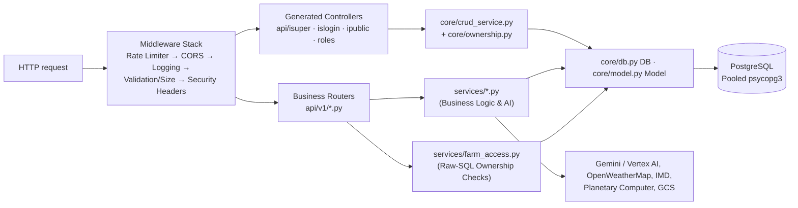

# CropSense AI — Backend Architecture & Specification (v2)
*Last updated: 2026-09-28 (Incorporating P0–P3 Security, Workflow, and Operational Fixes)*

How the FastAPI backend (`python/app/`) is organized: the core layer, generated CRUD controllers, 51 hand-written `api/v1` routers (394 endpoints), business services, AI agent architecture, background job scheduling, and security controls.

For the system deployment picture see [ARCHITECTURE.md](ARCHITECTURE.md); for frontend integration see [FRONTEND.md](FRONTEND.md); for table schemas see [DATA_MODEL.md](DATA_MODEL.md); and for ongoing remediation items see [IMPROVEMENTS.md](IMPROVEMENTS.md).

---

## Quick Reference Index
| Section | Covers |
| ------ | ------ |
| [1. Layers & Request Lifecycle](#1-layers--request-lifecycle) | Request execution path, middleware stack, and layer boundaries |
| [2. App Startup (main.py)](#2-app-startup-mainpy) | Middleware order, router mounting, startup events, and GCP sizing |
| [3. Core Infrastructure (core/)](#3-core-infrastructure-core) | Database pool, psycopg custom ORM, ownership security, and auth dependencies |
| [4. Generated CRUD Controllers](#4-generated-crud-controllers) | Handlers for `/isuper`, `/islogin`, `/ipublic`, and role namespaces |
| [5. Business Routers (api/v1/)](#5-business-routers-apiv1) | Breakdown of all 51 domain routers |
| [6. Business Services (services/)](#6-business-services-services) | Hand-written business logic, AI connectors, satellite processing, and workflows |
| [7. AI Agent & Scheduled Jobs](#7-ai-agent--scheduled-jobs) | ADK agent tools, Cloud Scheduler integration, and advisory locking |
| [8. Security Controls & Endpoint Audits](#8-security-hardening--endpoint-audits) | P0/P1 fixes: admin dependency enforcement, caller-based scoping, and session clearing |
| [9. Summary of Applied P0–P3 Enhancements](#9-summary-of-applied-p0p3-enhancements) | Detailed log of security, reliability, and flow fixes implemented |
| [Appendix: Endpoint Map](#appendix-endpoint-map) | Comprehensive router and endpoint listings |

All paths are prefixed with `/api/v1` unless noted otherwise.

---

## 1. Layers & Request Lifecycle

### Layer Rules & Boundaries
| Layer | Location | Generator Status | Architectural Constraints |
| ------ | ------ | ------ | ------ |
| **Pydantic Schemas** | `app/models/<table>.py` | Generated (`php setup.php`) | Auto-generated. Never edit by hand. |
| **ORM Classes** | `app/orm/<table>.py` | Generated | Auto-generated wrapper for table structure. |
| **Table Services** | `app/services/<table>_service.py` | Generated | Subclass of `CrudService`. Must remain free of custom business logic (overwritten during rebuilds). |
| **Role Controllers** | `app/api/{isuper,islogin,ipublic,roles}/` | Generated | Handles standard CRUD. Customizations must be flagged in `config.json` (`"customised": true`). |
| **Business Routers** | `app/api/v1/*.py` | Hand-written | Domain workflows and AI endpoints. Plain CRUD belongs in role controllers. |
| **Business Services** | `app/services/<name>.py` | Hand-written | Pure Python logic (e.g., `booking_workflow.py`, `satellite_health.py`, `voice_assist_service.py`). |

---

## 2. App Startup (`main.py`)

1. **Configuration Loading**: Settings are initialized from `core/config.py` (reading environment variables with GCP Secret Manager fallback in production).
2. **Middleware Execution Stack** (executed outer-to-inner):
   * **Rate Limiter**: `core/rate_limiter.py` (Redis sliding window; fails open if Redis is unavailable).
   * **CORS**: Configured with strict origin controls.
   * **Request Logging**: Structured debug/info logging with correlation IDs.
   * **Request Validation (`RequestValidationMiddleware`)**: Enforces a 10 MB payload ceiling, JSON structural complexity limits, and a 10,000-character cap on standard string fields (exempting `*_base64` fields).
   * **Security Headers (`SecurityHeadersMiddleware`)**: Injects CSP, X-Frame-Options, and HSTS headers.
   * *Note*: CSRF middleware is disabled because authentication relies on stateless Bearer JWTs.
3. **Generated Router Mounting**:
   * Mounted under `/api/v1` from `api/routers.py`. Guards are attached at the router mounting point:
     * `/isuper/*`: Guarded by `get_current_admin`.
     * `/islogin/*`: Guarded by `get_current_active_user`.
     * `/service_provider/*`: Guarded by `require_role(["service_provider", "admin"])`.
     * `/ipublic/*`: Publicly accessible (read-only reference data).
4. **Business Router Mounting**:
   * Mounted sequentially. Handlers in `users.py` (containing `/{user_id}` catch-alls) are mounted last to prevent path collision.
   * Custom route aliases:
     * `advance_booking` → `/api/v1/marketplace/advance-bookings/*`
     * `upload` → `/api/v1/upload/*`
5. **Health Endpoints**:
   * Mounted at root level (`/health`, `/health/ready`, `/health/db`) bypassing `/api/v1`.
6. **Startup Lifespan Events (`startup_event`)**:
   1. Initialize Redis connection pool (`cache.py`).
   2. Attach rate limiter to Redis.
   3. Seed SHC state/district codes if missing.
   4. Perform database ping and verify pool readiness.
   5. Background jobs (`quota_reset_job`, `slusi_ingestion_job`, `weekly_yield_update`) acquire a Postgres advisory lock (`pg_advisory_lock`) before execution to prevent duplicate execution across scaled Cloud Run instances.

---

## 3. Core Infrastructure (`core/`)

| Module | Purpose & Implementation Details |
| ------ | ------ |
| `config.py` | Centralized settings: DB credentials, Redis connection, Firebase Auth keys, Gemini models (`GEMINI_MODEL`, `GEMINI_ASSIST_MODEL`), GCS bucket targets, rate limit thresholds, and `E2E_ACTIVE` flag. |
| `db.py` | Direct query builder relying on `psycopg3` (`DB.raw(sql, bind)`, `.exe()`, `.result`, `.rows`). Uses SQLAlchemy purely as a lightweight connection pool (`DB_POOL_SIZE=2`, `DB_MAX_OVERFLOW=2` per worker process). |
| `model.py` | Base ActiveRecord pattern: `.where().and_where().get()`, `.first()`, `.find(id)`, `.create(data)`, `.update()`, `.upsert()`, `.with_rel()`, `.paginate(limit, offset)`. Strips unrecognized keys automatically on write operations. |
| `database.py` | Connection string setup, async engine configuration, and legacy `get_db` session dependency. |
| `crud_service.py` | Base class (`CrudService`) for generated table services (`all`, `find`, `where`, `create`, `update`, `upsert`, `delete`). Integrates `ownership.py` rules when `owner` context is provided. Updated with optional `limit` and `offset` pagination on `.all()`. |
| `ownership.py` | Row-level security enforcement containing: `OWNERSHIP` (SQL rules per table), `SHARED_READ` (veterinarians, service providers), `OWNER_COLUMNS` (auto-populated caller ID on creation), and `PARENTS` (parent record ownership verification). Updated with `requester_id` rule for `transport_bookings`. |
| `auth.py` | `FirebaseTokenValidator` verifies Bearer tokens → retrieves user context → supplies `get_current_active_user` and `get_current_admin`. Supports fallback lookup by `firebase_id` when `username` is null. Includes `mock-token-<email>` for E2E testing mode. |
| `dependencies.py` | Typed FastAPI dependencies: `CurrentUser`, `CurrentFarmer`, `CurrentAdmin`, `OptionalUser`, `DB`, `AuthCredentials`. |
| `rate_limiter.py` | Sliding window rate limiting using Redis, with separate thresholds for public vs authenticated endpoints. Fails open on cache connection drop. |
| `security_middleware.py` | Sanitization utilities and JSON payload size/depth validation. |
| `file_storage.py` | File storage driver. Mandates configured `GCS_BUCKET` in production environment to prevent data loss from ephemeral `/tmp/uploads`. |

---

## 4. Generated CRUD Controllers

Standardized CRUD interfaces generated per table across four access namespaces:

| Namespace | Mount Path | Controller Count | Target Audience | Access & Scoping |
| ------ | ------ | ------ | ------ | ------ |
| `/isuper` | `/api/v1/isuper/<table>/` | 57 | Admin | Unrestricted access across all rows. |
| `/islogin` | `/api/v1/islogin/<table>/` | 52 | Authenticated Users | Scoped dynamically via `ownership.py`. Tables without explicitly defined ownership rules are treated as read-only. |
| `/ipublic` | `/api/v1/ipublic/<table>/` | 15 | Public | Unauthenticated read-only access. |
| `/service_provider` | `/api/v1/service_provider/service/` | 1 | Service Providers | Owner-restricted read and write access. |

### Standard Route Operations
* **`GET /`**: Invokes `service.all(owner, limit, offset)`. Returns array of matching records ordered by `id DESC`. Supported pagination params prevent memory exhaustion.
* **`GET /{id}`**: Invokes `service.find(id, owner)`. Returns single object or `404 Not Found`.
* **`POST /`**: Invokes `service.create(payload, owner)`. Automatically binds owner ID fields, validates parent row ownership, and returns created object (`201 Created`).
* **`PUT /{id}`**: Invokes `service.update(id, payload, owner)`. Prevents modification of immutable owner columns.
* **`DELETE /{id}`**: Invokes `service.delete(id, owner)`. Returns `{"success": true}` upon deletion.

*Customized Controllers (Exempt from Regeneration)*: `active_role`, `buyer_interest`, `farm`, `livestock`, `marketplace_listing`, `role`, `user`, `ai_usage_quota`, `veterinarians`, `push_subscription`.

---

## 5. Business Routers (`api/v1/`)

The 51 custom business routers provide specialized API capability domains:

### Account, Auth & Platform (7 Routers)
* `auth.py` (`/auth`): Firebase token verification, `/user` profile retrieval, `/refresh` token handling (with `firebase_id` lookup), `/logout`, and legacy authentication compatibility endpoints.
* `users.py` (`/users`): User profile management, password updates, MFA preference handlers, and administrative user search.
* `ai_quota.py` (`/ai-quota`): Quota verification, usage incrementing, daily limit status, and admin quota reset tools.
* `notifications.py` (`/notifications`): VAPID public key delivery (`GET /notifications/vapid-public-key`), WebPush sub/unsub, push testing, and user inbox management.
* `upload.py` (`/upload`): GCS-backed image upload handlers with secure public asset serving.
* `address.py` (`/address`): Pincode lookup, distance matrix calculations, and address verification.
* `health.py` (`/health`): Production health checks (`/health/live`, `/health/ready`, `/health/db`). AWS Bedrock route marked legacy.

### Farm, Crop & Strategic Planning (10 Routers)
* `farms.py` (`/farms`): Farm CRUD with embedded plot structures, geolocation lookup, and soil associations.
* `crops.py` (`/crops`): Crop registration, quick-plant workflow with companion planting suggestions, expense logging, and crop lifecycle management.
* `crop_milestones.py` (`/crop-milestones`): Tracking development stages via `crop_growth_tracker.py`.
* `annual_strategy.py` (`/annual-strategy`): Multi-season crop planning powered by Gemini. `POST /annual-strategy` returns created strategy ID and standardizes payload schemas (`total_expected_profit`).
* `crop_recommendations.py` (`/crop-recommendations`): RAG recommendation engine. Endpoint `/crop-recommendations/health` dynamically reports vector index status.
* `plot_analysis.py` (`/plot-analysis`): Soil suitability and ROI analysis.
* `plot_publishing.py` (`/plot-publishing`): Pre-harvest harvest publishing to marketplace.
* `yield_predictions.py` (`/yield-predictions`): AI yield predictions.
* `analytics.py` (`/analytics`): Dashboard metrics, farm performance aggregates, and platform executive reporting.
* `community_dashboard.py` (`/community`): Aggregated community agriculture metrics.

### Soil, Weather & Pest Management (13 Routers)
* `soil.py` (`/soil`): Soil health telemetry (`/soil/health/plot/{id}`) and fertilizer requirements.
* `soil_health.py` (`/soil-health`): Soil health tracking and PDF report parsing.
* `soil_testing.py` (`/soil-testing`): Lab sample tracking and PDF report processing (`/upload-pdf`).
* `soil_maps.py` (`/soil-maps`): SHC/NBSS spatial mapping, GPS lookup, and peer farm comparisons.
* `slusi.py` (`/slusi`): SLUSI land capability classification and microwatershed data ingestion.
* `fertilizer_recommendations.py` (`/fertilizer-recommendations`): NPK formulation advice.
* `fertilizer_tracking.py` (`/fertilizer-tracking`): Field application logs.
* `weather.py` (`/weather`): Live weather, forecasts, and agricultural alerts (OpenWeatherMap with IMD fallback).
* `severe_weather.py` (`/severe-weather`): Extreme weather risk monitoring per farm plot.
* `weather_recommendations.py` (`/weather-recommendations`): Weather-contingent farming advice.
* `pest_disease.py` (`/pest-disease`): Disease identification, treatments, and regional risk alerts.
* `vision_diagnosis.py` (`/vision`): Multimodal Gemini Vision leaf and crop diagnosis (`/diagnose-crop`).
* `satellite.py` (`/satellite`): Sentinel-2 STAC telemetry (NDVI, NDMI, NDRE index curves).

### Livestock & Veterinary (9 Routers)
* `livestock.py` (`/livestock`): Animal record management and herd portfolio. Enforces strict caller-based scoping on `GET /` and `GET /farmer/{id}/portfolio` (query `farmer_id` overridden for non-admins).
* `livestock_health.py` (`/livestock-health`): Medical history, vaccination schedules, and health diagnostics (guarded by `enforce_livestock_owner`).
* `livestock_nutrition.py` (`/livestock-nutrition`): Feed formulations and nutritional planning.
* `livestock_breeding.py` (`/livestock-breeding`): Breeding logs, pregnancy tracking, and lineage.
* `livestock_transactions.py` (`/livestock-transactions`): Purchase, sale, and valuation records.
* `livestock_listings.py` (`/livestock-listings`): Marketplace listings catalog. Endpoints `POST /{id}/interest` and `POST /{id}/inquiry` require authentication/rate limiting.
* `livestock_marketplace.py` (`/livestock-marketplace`): Public animal trade catalog and ROI models.
* `vaccination_reminders.py` (`/vaccination-reminders`): Vaccination schedule reminders.
* `veterinary.py` (`/veterinary`): Doctor directory, AI symptom checker, and remote diagnosis records.

### Marketplace, Supply & Transport (7 Routers)
* `marketplace.py` (`/marketplace`): Crop trade listings, buyer lead creation, and search indexing.
* `advance_booking.py` (`/marketplace/advance-bookings`): Pre-harvest contract workflow. State machine supports transitions from `pending_farmer_confirmation` through confirmation, payment, verification, and completion.
* `supply_requests.py` (`/supply-requests`): Buyer demand requests, vector-matched farmer aggregation, and match confirmation.
* `transport.py` (`/transport`): Logistics estimation, booking, and real-time tracking. Scoping rule includes `requester_id` for booker visibility.
* `market_data.py` (`/market-data`): Price telemetry, historical yields, and market trends. Ingestion write endpoints (`POST /crop-prices`, `/crop-prices/bulk`, `/historical-yields`, `/crop-profitability`, `/seasonal-trends/store`, `/opportunity-cost/save`) secured with `Depends(get_current_admin)`.
* `market_intelligence.py` (`/market-intelligence`): Price forecasting, MSP tracking, and quality premium analytics.
* `predictive_analytics.py` (`/predictive-analytics`): Price trend models, supply gap analysis, and opportunity scoring.

### AI Infrastructure & Agents (5 Routers)
* `voice_agent.py` (`/voice`): Text and audio voice assistance (`/voice/assist`, `/voice/query`) with audit logging.
* `agents.py` (`/agents`): Google ADK orchestrator agent (`POST /agents/chat`).
* `hybrid_ai.py` (`/hybrid-ai`): Dynamic request routing between local models and Gemini APIs.
* `model_training.py` (`/model-training`): Custom yield prediction model retraining pipeline.
* `sagemaker.py` (`/sagemaker`): Legacy AWS SageMaker integration (maintained as compatibility interface).

---

## 6. Business Services (`services/`)

Core business logic modules located in `app/services/`:

* **Access & Security Helpers**: `farm_access.py` (raw-SQL row-level checks), `livestock_repository.py`.
* **Crop & Agronomy Logic**: `crop_growth_tracker.py`, `yield_profit_service.py`, `yield_prediction_update_service.py`, `profit_margin_service.py`, `plot_analysis_service.py`, `plot_publishing_service.py`, `analytics_service.py`.
* **AI & Machine Learning**: `voice_assist_service.py` (prompting, output sanitization, fallback rules), `voice_assist_audit.py`, `vision_diagnosis_service.py`, `agro_safety.py` (enforces banned active ingredient filtering and safety bounds), `explainability.py`, `crop_recommendation_service.py` (RAG vector lookup), `hybrid_ai_service.py`, `model_training_service.py`, `vector_service.py` (pgvector similarity).
* **Satellite Processing**: `satellite_health.py` (STAC API client for Planetary Computer, Sentinel-2 L2A SCL cloud masking, 5-day cadence check).
* **Soil & Geospatial**: `slusi_service.py`, `dss_parser.py`, `shc_fetcher.py`, `shc_code_mapper.py`, `nbss_service.py`, `soil_mapping.py`, `soil_testing_service.py`, `soil_health_report_service.py`, `fertilizer_recommendation_service.py`, `fertilizer_tracking_service.py`.
* **Weather & Risk**: `weather_service.py` (OpenWeatherMap / IMD failover orchestrator), `openweathermap_service.py`, `imd_service.py`, `severe_weather_service.py`, `weather_recommendations_service.py`, `pest_disease_service.py`.
* **Livestock & Veterinary**: `livestock_health_service.py`, `livestock_nutrition_service.py`, `livestock_breeding_service.py`, `livestock_roi_service.py`, `vaccination_reminder_service.py`, `veterinary_service.py`, `veterinarian_directory_service.py`, `livestock_listing_catalog.py`, `livestock_trade_workflow.py`, `transport_service.py`.
* **Marketplace & Supply Chain**: `marketplace_service.py`, `booking_workflow.py` (advance booking state transitions), `booking_reminder_service.py`, `supply_request_matching_service.py` (pgvector cosine matching for farmer matching), `market_data_service.py`, `price_tracking_service.py`, `predictive_analytics_service.py`, `seasonal_trend_analysis.py`.
* **Location Utilities**: `address_service.py`, `pincode_lookup_service.py`.
* **Platform & Infrastructure**: `ai_quota_service.py`, `file_storage.py` (GCS integration), `notification_inbox.py`, `web_push_service.py`, `bigquery_service.py`, `firestore_service.py`.
* **Legacy Compatibility Shims**: `bedrock_service.py`, `sagemaker_service.py`, `cognito_service.py`, `notification_service.py` (AWS SNS shim).

---

## 7. AI Agent & Scheduled Jobs

### ADK Agent Orchestration (`agents/`)
* **`orchestrator_agent.py`**: Google ADK root agent handling natural language conversation via `POST /agents/chat`.
* **`agent_tools.py`**: Functional agent tools: `get_farm_details`, `get_soil_info`, `get_weather_forecast`, `get_market_prices`.
* Tools execute strictly under the security context of the authenticated user set via `set_agent_user`.

### Scheduled Background Jobs (`jobs/`)
To ensure idempotency across horizontally scaled Cloud Run instances (up to 10 nodes), background jobs utilize PostgreSQL advisory locking (`pg_advisory_lock`):

| Job Module | Purpose & Logic | Execution Schedule |
| ------ | ------ | ------ |
| `quota_reset_job.py` | Resets `ai_usage_quota` counters for all active users. | Daily at 00:00 IST via Cloud Scheduler / Advisory Lock. |
| `slusi_ingestion_job.py` | Scrapes latest SLUSI survey data into `slusi_lcc_reports` and `slusi_microwatershed_maps`. | Configurable interval (`SLUSI_INGEST_INTERVAL_DAYS`). |
| `weekly_yield_update.py` | Recalculates crop yield predictions across active plots using updated weather and satellite data. | Weekly job triggered via Cloud Scheduler. |

---

## 8. Security Hardening & Endpoint Audits

### Unauthenticated Write Endpoint Protection (P0 Fixed)
The following reference data ingestion endpoints previously permitted anonymous writes and have been secured with mandatory admin authentication (`dependencies=[Depends(get_current_admin)]`):
* `POST /api/v1/market-data/crop-prices`
* `POST /api/v1/market-data/crop-prices/bulk`
* `POST /api/v1/market-data/historical-yields`
* `POST /api/v1/market-data/crop-profitability`
* `POST /api/v1/market-data/seasonal-trends/store`
* `POST /api/v1/market-data/opportunity-cost/save`

Public interest and inquiry endpoints (`POST /api/v1/livestock-listings/{id}/interest`, `/inquiry`) are enforced with authentication or IP-based sliding-window rate limits.

### Row-Level Data Scoping (P0 Fixed)
* **`GET /api/v1/livestock/` & `/livestock/farmer/{id}/portfolio`**: Handler ignores caller-supplied `farmer_id` URL query parameters for non-admin accounts and defaults strictly to `CurrentUser.id`. Viewing other farmer portfolios is restricted exclusively to `CurrentAdmin`.

---

## 9. Summary of Applied P0–P3 Enhancements

| Category | Item # | Targeted Issue | Applied Resolution | Affected Code Files |
| ------ | ------ | ------ | ------ | ------ |
| **P0 Security** | #1 | Unauthorized herd/portfolio reading | Ignored `farmer_id` query param for non-admins; strictly scoped queries to `CurrentUser.id`. | `api/v1/livestock.py` |
| **P0 Security** | #2 | Unauthenticated market reference data modification | Added `dependencies=[Depends(get_current_admin)]` to write handlers. Reads remain public. | `api/v1/market_data.py` |
| **P0 Security** | #5 | Anonymous listing counter inflation | Enforced sign-in / sliding window rate limiting on interest and inquiry endpoints. | `api/v1/livestock_listings.py` |
| **P1 Fix** | #7 | Unconfirmable matched bookings | Updated `booking_workflow.py` state machine to accept `pending_farmer_confirmation` state during confirmation. | `services/booking_workflow.py`, `supply_request_matching_service.py` |
| **P1 Fix** | #9 | Schema mismatch on strategy result generation | Standardized field mapping (`total_expected_profit`) and returned created record ID on POST. | `api/v1/annual_strategy.py` |
| **P1 Fix** | #16 | Invisible transport bookings for booker | Added `OR t.requester_id = {uid}` to ownership evaluation rule and registered `requester_id` in `OWNER_COLUMNS`. | `core/ownership.py` |
| **P1 Fix** | #17 | Token refresh failure without username | Modified `/auth/refresh` handler to perform fallback account resolution using `firebase_id`. | `api/v1/auth.py` |
| **P2 Reliability** | #18 | Idempotency issues on 5xx retries | Disabled automatic client retries on POST requests to prevent duplicated writes. | `lib/api-client.ts` |
| **P2 Reliability** | #19 | Redundant scheduler execution across instances | Integrated PostgreSQL advisory locks (`pg_advisory_lock`) and Cloud Scheduler admin endpoints. | `main.py`, `jobs/*.py` |
| **P2 Reliability** | #20 | Unscheduled weekly yield update job | Added job configuration to background execution scheduler. | `jobs/weekly_yield_update.py` |
| **P2 Reliability** | #23 | Ephemeral storage risk on uploads | Enforced mandatory `GCS_BUCKET` configuration in production startup checks. | `services/file_storage.py` |
| **P2 Reliability** | #24 | Missing list pagination in CRUD service | Added optional `limit` and `offset` parameters to `CrudService.all()` with backward compatibility. | `core/crud_service.py` |
| **P2 Reliability** | #26 | Persistent 503 response on recommendation health | Updated endpoint to query pgvector store connection state and report fallback Gemini mode. | `api/v1/crop_recommendations.py` |
| **P3 Maintenance** | #35 | Active AWS modules in GCP environment | Flagged legacy AWS services as compatibility shims and excluded them from GCP readiness probes. | `core/monitoring.py`, `services/bedrock_service.py` |

---

## Appendix: Endpoint Map

The full 394 endpoints spanning all 51 routers are structured under their respective module files:

<b>Address Management (4 Endpoints)</b> — <code>address.py</code>

| Method | Path | Handler | Auth |
| ------ | ------ | ------ | ------ |
| POST | `/address/auto-fill` | `auto_fill_address` | None |
| POST | `/address/validate` | `validate_address` | None |
| GET | `/address/pincode/{pincode}` | `lookup_pincode` | None |
| POST | `/address/distance` | `calculate_distance` | None |

<b>Advance Bookings (10 Endpoints)</b> — <code>advance_booking.py</code>

| Method | Path | Handler | Auth |
| ------ | ------ | ------ | ------ |
| POST | `/marketplace/advance-bookings` | `create_advance_booking` | User |
| GET | `/marketplace/advance-bookings` | `list_bookings` | User |
| GET | `/marketplace/advance-bookings/{id}` | `get_booking` | User |
| PUT | `/marketplace/advance-bookings/{id}` | `update_booking_status` | User |
| POST | `/marketplace/advance-bookings/{id}/confirm` | `confirm_booking` | User |
| POST | `/marketplace/advance-bookings/{id}/cancel` | `cancel_booking` | User |
| POST | `/marketplace/advance-bookings/{id}/complete` | `complete_booking` | User |
| POST | `/marketplace/advance-bookings/{id}/quality-verify` | `quality_verify` | User |
| POST | `/marketplace/advance-bookings/{id}/dispute` | `raise_dispute` | User |
| POST | `/marketplace/advance-bookings/{id}/payments` | `record_payment` | User |

<b>AI Agent Orchestration (1 Endpoint)</b> — <code>agents.py</code>

| Method | Path | Handler | Auth |
| ------ | ------ | ------ | ------ |
| POST | `/agents/chat` | `chat_with_agent` | User |

<b>AI Quotas (6 Endpoints)</b> — <code>ai_quota.py</code>

| Method | Path | Handler | Auth |
| ------ | ------ | ------ | ------ |
| GET | `/ai-quota/status/{user_id}` | `get_quota_status` | User |
| POST | `/ai-quota/check` | `check_quota` | User |
| POST | `/ai-quota/increment` | `increment_usage` | User |
| POST | `/ai-quota/reset` | `reset_daily_quota` | Admin |
| PUT | `/ai-quota/limit/{user_id}` | `update_quota_limit` | Admin |
| GET | `/ai-quota/statistics` | `get_usage_statistics` | Admin |

<b>Analytics & Reports (10 Endpoints)</b> — <code>analytics.py</code>

| Method | Path | Handler | Auth |
| ------ | ------ | ------ | ------ |
| GET | `/analytics/profile-status` | `get_profile_status` | User |
| GET | `/analytics/dashboard` | `get_dashboard_analytics` | User |
| GET | `/analytics/farm-performance` | `get_farm_performance` | User |
| GET | `/analytics/crop-performance` | `get_crop_performance` | User |
| GET | `/analytics/market-trends` | `get_market_trends_api` | User |
| GET | `/analytics/farmer/{farmer_id}` | `get_farmer_analytics` | User |
| GET | `/analytics/farm/{farm_id}` | `get_farm_analytics_api` | User |
| GET | `/analytics/platform` | `get_platform_analytics` | Admin |
| GET | `/analytics/market` | `get_market_analytics` | User |
| GET | `/analytics/executive-report` | `get_executive_report` | Admin |

<b>Annual Crop Strategy (6 Endpoints)</b> — <code>annual_strategy.py</code>

| Method | Path | Handler | Auth |
| ------ | ------ | ------ | ------ |
| POST | `/annual-strategy` | `generate_annual_strategy` | User |
| POST | `/annual-strategy/save` | `save_annual_strategy` | User |
| GET | `/annual-strategy/list` | `list_strategies` | User |
| GET | `/annual-strategy/{id}` | `get_strategy` | User |
| PUT | `/annual-strategy/{id}/status` | `update_status` | User |
| POST | `/annual-strategy/{id}/feedback` | `add_feedback` | User |

<b>Authentication & Sessions (16 Endpoints)</b> — <code>auth.py</code>

| Method | Path | Handler | Auth |
| ------ | ------ | ------ | ------ |
| POST | `/auth/signup` | `sign_up` | None |
| POST | `/auth/signin` | `sign_in` | None |
| POST | `/auth/firebase` | `firebase_auth` | None |
| POST | `/auth/google` | `google_auth_alias` | None |
| GET | `/auth/user` | `get_auth_user` | Token |
| POST | `/auth/refresh` | `refresh_token` | Token |
| POST | `/auth/refresh-token` | `refresh_token_alias` | Token |
| POST | `/auth/logout` | `logout` | Token |

