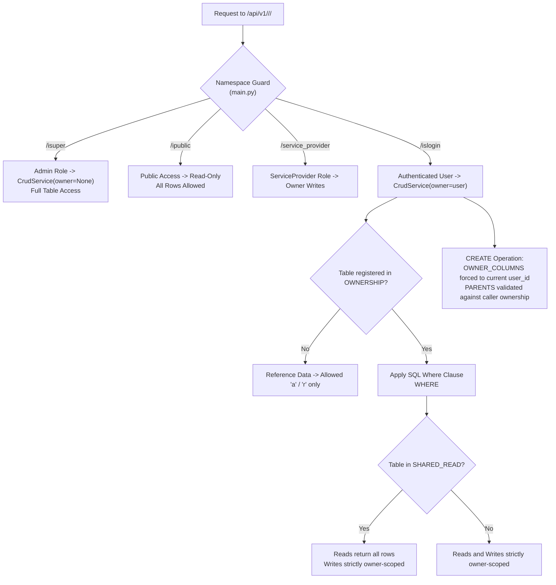
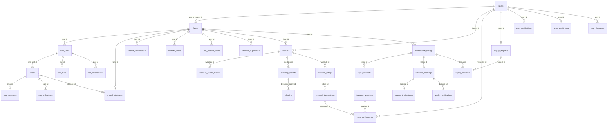

### CropSense AI — Data Model
*Last updated: 2026-09-28 (v2 — synchronized with backend security fixes and deployment migrations).*

The 58 database tables: where they are defined, how they link, who can read and change each one, how ownership is enforced, and how to safely apply additive schema migrations. For backend implementations see [BACKEND-v2.md](BACKEND-v2.md); for frontend routes and contracts see [FRONTEND-v2.md](FRONTEND-v2.md).

| Section | Covers |
| ------ | ------ |
| [1. Source of Truth](#1-source-of-truth) | Model JSON → generated SQL, ORM, services, and reactive stores |
| [2. All Tables](#2-all-tables) | 58 tables: columns, role CRUD letters, owner rules, and relations |
| [3. Ownership and Access Control](#3-ownership-and-access-control) | Ownership enforcement, SHARED_READ, OWNER_COLUMNS, PARENTS |
| [4. Main Relations](#4-main-relations) | Entity-Relationship (ER) diagram for core domains |
| [5. Schema Change Protocol](#5-schema-change-protocol) | Additive-only rules, generator invocation, and verification |
| [6. Migrations and Deployment](#6-migrations-and-deployment) | Deploy migration sequence, CloudSQL baseline, and status |
| [7. Data-Model Audit and Resolved Gaps](#7-data-model-audit-and-resolved-gaps) | Security patches, query pagination, and schema alignment |

---

#### 1. Source of Truth

Each table is declared as a single JSON model definition in `database/Model/<name>.json`:

```jsonc
{
  "name": "crop",              // Model name -> Crop, crop_service.py, /islogin/crop/
  "table": "crops",            // SQL table name in PostgreSQL
  "crud": {                    // Role permissions: c (create), r (read one), u (update), a (list all), d (delete), p (paginate)
    "isuper":  ["c","r","u","a","d"],
    "islogin": ["c","r","a","u","d"],
    "public":  ["r"],
    "roles":   { "service_provider": ["c","r","u","a","d"] }
  },
  "enable": 1,                 // Adds enable SMALLINT DEFAULT 1 column
  "relations": { 
    "farm_plot": { "name": "farm_plot_id", "key": "id", "table": "farm_plots" } 
  },
  "data": [ 
    { "name": "crop_name", "datatype": "string", "mysql_data": "varchar(255)", "sql_attribute": "NOT NULL" } 
  ]
}
```

* **Implicit Columns:** Every table automatically receives `id BIGSERIAL PRIMARY KEY`, `created_at TIMESTAMP DEFAULT CURRENT_TIMESTAMP`, `updated_at TIMESTAMP DEFAULT CURRENT_TIMESTAMP`, and `enable SMALLINT DEFAULT 1`.
* **Generator Pipeline (`php setup.php`):** Compiles JSON models into:
  * SQL Schemas: `database/structure.sql` and `database/relation.sql`
  * Python Backend: `python/app/models/*.py`, `python/app/orm/*.py`, `python/app/services/*_service.py`, and `python/app/api/{isuper,islogin,ipublic,roles}/*.py`
  * SolidJS Frontend: `solidjs/src/shared/{Interface,Service,Store}/*.ts`
* **Database Engine:** PostgreSQL (Cloud SQL) with `pgvector` enabled for high-dimensional supply-request vector search.

---

#### 2. All Tables

##### Column Legend
| Symbol | Definition |
| ------ | ---------- |
| **Cols** | Custom data columns declared in JSON (excluding `id`, `created_at`, `updated_at`, `enable`) |
| **isuper / islogin / public** | Role-based CRUD permission letters |
| **Owner Rule** | SQL condition in `core/ownership.py` scoping `/islogin` operations (`me` = current user ID; `my X` = rows owned by caller) |
| **Reference Data** | Shared reference tables with no ownership restriction (read-only for `/islogin`) |

##### 2.1 Users and Roles (7 tables)
| Model -> Table | Cols | isuper | islogin | public | Owner Rule (`islogin`) | Key Relations |
| -------------- | ---- | ------ | ------- | ------ | --------------------- | ------------- |
| `user` -> `users` | 21 | carud | aru | – | `t.id = me` | Primary identity table |
| `role` -> `roles` | 1 | carup | – | – | System roles (`admin`, `farmer`, `buyer`, `vet`, `service_provider`) | – |
| `active_role` -> `active_roles` | 2 | carudp | ar | – | `t.user_id = me` | `user_id`->`users`, `role_id`->`roles` |
| `ai_usage_quota` -> `ai_usage_quota` | 6 | carud | ar | – | `t.user_id = me` | `user_id`->`users` |
| `system_setting` -> `system_settings` | 3 | carud | – | – | System global configurations | – |
| `user_notification` -> `user_notifications` | 8 | carud | arud | – | `t.user_id = me` | `user_id`->`users` |
| `push_subscription` -> `push_subscriptions` | 5 | ard | – | – | Web Push browser subscriptions | `user_id`->`users` |

##### 2.2 Farms and Crops (8 tables)
| Model -> Table | Cols | isuper | islogin | public | Owner Rule (`islogin`) | Key Relations |
| -------------- | ---- | ------ | ------- | ------ | --------------------- | ------------- |
| `farm` -> `farms` | 45 | carud | carud | – | `t.user_id = me OR t.owner_id = me` | `user_id`, `owner_id`->`users` |
| `farm_plot` -> `farm_plots` | 19 | carud | carud | – | `t.farm_id IN (my farms)` | `farm_id`->`farms` |
| `crop` -> `crops` | 15 | carud | carud | – | `t.farm_plot_id IN (my farm_plots)` | `farm_plot_id`->`farm_plots`, `strategy_id`->`annual_strategies` |
| `crop_expense` -> `crop_expenses` | 5 | carud | carud | – | `t.crop_id IN (my crops)` | `crop_id`->`crops` |
| `crop_milestone` -> `crop_milestones` | 11 | carud | carud | – | `t.crop_id IN (my crops)` | `crop_id`->`crops` |
| `annual_strategy` -> `annual_strategies` | 18 | carud | carud | – | `t.farmer_id = me OR t.farm_id IN (my farms)` | `farm_id`->`farms`, `farmer_id`->`users` |
| `crop_diagnosis` -> `crop_diagnoses` | 16 | ard | ard | – | `t.user_id = me` | `user_id`->`users` |
| `satellite_observation` -> `satellite_observations` | 11 | ard | ar | – | `t.farm_id IN (my farms)` | `farm_id`->`farms` |

##### 2.3 Soil, Climate, and Pests (15 tables)
| Model -> Table | Cols | isuper | islogin | public | Owner Rule (`islogin`) | Key Relations |
| -------------- | ---- | ------ | ------- | ------ | --------------------- | ------------- |
| `soil_test` -> `soil_tests` | 39 | carud | carud | – | `t.plot_id IN (my farm_plots)` | `plot_id`->`farm_plots` |
| `soil_test_result` -> `soil_test_results` | 23 | carud | carud | – | `t.farm_id IN (my farms)` | `farm_id`->`farms`, `plot_id`->`farm_plots` |
| `soil_amendment` -> `soil_amendments` | 30 | carud | carud | – | `t.plot_id IN (my farm_plots)` | `plot_id`->`farm_plots` |
| `fertilizer_application` -> `fertilizer_applications` | 28 | carud | carud | – | `t.farm_id IN (my farms)` | `farm_id`->`farms`, `plot_id`->`farm_plots`, `crop_id`->`crops` |
| `soil_moisture_data` -> `soil_moisture_data` | 7 | carud | ar | r | Reference data | – |
| `weather_forecast` -> `weather_forecasts` | 36 | carud | ar | ar | Reference data | – |
| `weather_alert` -> `weather_alerts` | 10 | carud | ar | – | `t.farm_id IN (my farms)` | `farm_id`->`farms` |
| `pest_disease_alert` -> `pest_disease_alerts` | 16 | carud | carud | – | `t.farm_id IN (my farms)` | `crop_id`->`crops`, `farm_id`->`farms` |
| `pest_disease_data` -> `pest_disease_data` | 18 | carud | ar | – | Reference data | – |
| `shc_state_district_code` -> `shc_state_district_codes` | 4 | ar | ar | – | Reference data | Soil Health Card district mapping |
| `slusi_lcc_report` -> `slusi_lcc_reports` | 18 | ar | ar | – | Reference data | Land capability classification |
| `slusi_microwatershed_map` -> `slusi_microwatershed_maps` | 4 | ar | ar | – | Reference data | Microwatershed GIS shapes |
| `slusi_ingestion_run` -> `slusi_ingestion_runs` | 6 | ar | – | – | Ingestion execution logs | – |
| `ndap_ingestion_run` -> `ndap_ingestion_runs` | 7 | ar | – | – | NDAP data ingestion tracking | – |
| `ndap_downloaded_file` -> `ndap_downloaded_files` | 3 | – | – | – | Internal raw storage tracker | – |

##### 2.4 Livestock (9 tables)
| Model -> Table | Cols | isuper | islogin | public | Owner Rule (`islogin`) | Key Relations |
| -------------- | ---- | ------ | ------- | ------ | --------------------- | ------------- |
| `livestock` -> `livestock` | 19 | carud | carud | – | `t.farmer_id = me` | `farm_id`->`farms`, `farmer_id`->`users` |
| `livestock_health_record` -> `livestock_health_records` | 8 | carud | carud | – | `t.livestock_id IN (my livestock)` | `livestock_id`->`livestock` |
| `breeding_record` -> `breeding_records` | 13 | carud | carud | – | `t.farmer_id = me` | `livestock_id`->`livestock`, `mate_id`->`livestock` |
| `offspring` -> `offspring` | 13 | carud | carud | – | `t.farmer_id = me` | `breeding_record_id`->`breeding_records`, `livestock_id`->`livestock` |
| `livestock_roi_prediction` -> `livestock_roi_predictions` | 49 | carud | carud | – | `t.user_id = me OR t.animal_id IN (my livestock)` | `animal_id`->`livestock`, `user_id`->`users` |
| `livestock_listing` -> `livestock_listings` | 38 | carud | carud | r | `t.farmer_id = me` | `livestock_id`->`livestock`, `farmer_id`->`users` |
| `livestock_marketplace_listing` -> `livestock_marketplace_listings` | 23 | carud | carud | – | `t.farmer_id = me` | `livestock_id`->`livestock`, `farmer_id`->`users` |
| `livestock_transaction` -> `livestock_transactions` | 21 | carud | carud | – | `t.seller_id = me OR t.buyer_id = me` | `listing_id`->`livestock_listings`, `seller_id`/`buyer_id`->`users` |
| `veterinarian` -> `veterinarians` | 16 | carud | carud | ar | `t.added_by_user_id = me` (Shared Read) | `added_by_user_id`->`users` |

##### 2.5 Marketplace and Supply Chain (7 tables)
| Model -> Table | Cols | isuper | islogin | public | Owner Rule (`islogin`) | Key Relations |
| -------------- | ---- | ------ | ------- | ------ | --------------------- | ------------- |
| `marketplace_listing` -> `marketplace_listings` | 21 | carud | carud | r | `t.farmer_id = me` | `farm_id`->`farms`, `farmer_id`->`users` |
| `buyer_interest` -> `buyer_interests` | 15 | carud | carud | – | `t.listing_id IN (my marketplace_listings)` | `listing_id`->`marketplace_listings` |
| `advance_booking` -> `advance_bookings` | 13 | carud | carud | – | `t.buyer_id = me OR t.farmer_id = me` | `listing_id`->`marketplace_listings`, `buyer_id`/`farmer_id`->`users` |
| `payment_milestone` -> `payment_milestones` | 8 | carud | carud | – | `t.booking_id IN (my advance_bookings)` | `booking_id`->`advance_bookings` |
| `quality_verification` -> `quality_verifications` | 8 | carud | carud | – | `t.booking_id IN (my advance_bookings)` | `booking_id`->`advance_bookings` |
| `supply_request` -> `supply_requests` | 20 | carud | carud | – | `t.buyer_id = me` | `buyer_id`->`users` |
| `supply_match` -> `supply_matches` | 15 | carud | carud | – | `t.farmer_id = me OR t.request_id IN (my supply_requests)` | `request_id`->`supply_requests`, `listing_id`->`marketplace_listings` |

##### 2.6 Transport and Services (2 tables)
| Model -> Table | Cols | isuper | islogin | public | Owner Rule (`islogin`) | Key Relations |
| -------------- | ---- | ------ | ------- | ------ | --------------------- | ------------- |
| `transport_provider` -> `transport_providers` | 20 | carud | carud | r | `t.user_id = me` | `user_id`->`users` |
| `transport_booking` -> `transport_bookings` | 29 | carud | carud | – | `t.provider_id IN (my providers) OR t.transaction_id IN (my transactions) OR t.requester_id = me` | `transaction_id`->`livestock_transactions`, `provider_id`->`transport_providers`, `requester_id`->`users` |
| `service` -> `services` | 16 | carud | ar | ar | `t.user_id = me` (Shared Read; role `service_provider` has `carud`) | `user_id`->`users` |

##### 2.7 Market Reference Data (8 tables)
| Model -> Table | Cols | isuper | islogin | public | Owner Rule (`islogin`) | Key Relations |
| -------------- | ---- | ------ | ------- | ------ | --------------------- | ------------- |
| `market_price` -> `market_prices` | 16 | carud | ar | r | Reference data (writes restricted to admin) | `listing_id`->`marketplace_listings`, `booking_id`->`advance_bookings` |
| `crop_market_data` -> `crop_market_data` | 8 | carud | – | r | Historical market prices | – |
| `price_prediction` -> `price_predictions` | 17 | carud | ar | r | ML output store | – |
| `msp_rate` -> `msp_rates` | 9 | carud | ar | r | Government Minimum Support Price benchmarks | – |
| `historical_yield` -> `historical_yields` | 21 | carud | ar | ar | District yield history | – |
| `crop_profitability` -> `crop_profitability` | 28 | carud | ar | ar | Profitability model outputs | – |
| `seasonal_trend` -> `seasonal_trends` | 24 | carud | ar | ar | Crop demand/price seasonality | – |
| `opportunity_cost` -> `opportunity_costs` | 27 | carud | ar | ar | Crop rotation trade-off analytics | – |

##### 2.8 AI Audit (1 table)
| Model -> Table | Cols | isuper | islogin | public | Owner Rule (`islogin`) | Key Relations |
| -------------- | ---- | ------ | ------- | ------ | --------------------- | ------------- |
| `voice_assist_log` -> `voice_assist_logs` | 14 | ard | ar | – | `t.user_id = me` | `user_id`->`users` |

---

#### 3. Ownership and Access Control



##### Security Rule Specifications (`python/app/core/ownership.py`)
1. **`OWNERSHIP` Registry:** Defines exact SQL WHERE constraints evaluated dynamically per query for authenticated callers.
2. **`SHARED_READ` Registry:** Applies to directory-style entities (`veterinarians`, `services`). Allows public or signed-in read visibility across all records, while enforcing owner-only updates and deletes.
3. **`OWNER_COLUMNS` Enforcer:** Automatically forces specified column values (e.g. `farms.user_id`, `livestock.farmer_id`, `supply_requests.buyer_id`, `transport_bookings.requester_id`) to the caller's verified `user_id` during `POST` operations, stripping client-supplied spoofed IDs.
4. **`PARENTS` Verification:** Validates parent foreign key ownership prior to child creation (e.g., verifying `farm_plots.farm_id` belongs to caller before inserting a plot), returning `404 Not Found` on ownership mismatch.

---

#### 4. Main Relations



---

#### 5. Schema Change Protocol

The system enforces a **strictly additive schema policy**. Tables, columns, and data values must never be destructively dropped or renamed.

1. **Model Modification:** Update or create JSON definitions in `database/Model/<name>.json`.
2. **Generator Invocation:** Execute `php setup.php` in a separate build workspace to regenerate SQL scripts and ORM boilerplate.
3. **Code Merge:** Selectively copy back generated models, Pydantic schemas, ORM mappings, and frontend interfaces into the codebase.
4. **Ownership Configuration:** Register ownership constraints in `core/ownership.py` under `OWNERSHIP`, `OWNER_COLUMNS`, and `PARENTS`.
5. **Migration Creation:** Write safe, idempotent migration scripts using `CREATE TABLE IF NOT EXISTS` and `ADD COLUMN IF NOT EXISTS` syntax in `database/migrations/`.
6. **Deploy Pipeline Integration:** Register the migration file in `deploy-gcp.sh` under the `MIGRATIONS` array.

---

#### 6. Migrations and Deployment

##### Automated Deploy Migration Pipeline (`deploy-gcp.sh`)
During production deployment to GCP Cloud Run and Cloud SQL, migrations are executed sequentially in a single idempotent transaction:

| Migration File | Description | Status |
| -------------- | ----------- | ------ |
| `create_push_subscriptions_table.sql` | Web Push browser notification storage | Executed |
| `2026-09-27-services-livestock-name.sql` | Service directory extension and livestock custom naming | Executed |
| `2026-09-27-crops-supporting-crop.sql` | Supporting crop hierarchy (`parent_crop_id`, `crop_role`) | Executed |
| `2026-09-27-ndap-ingestion-tables.sql` | NDAP data collection and file tracking schemas | Executed |
| `2026-09-27-voice-assist-logs.sql` | Multimodal AI voice interaction audit log | Executed |
| `2026-09-27-crop-diagnoses.sql` | Gemini Vision diagnosis store | Executed |
| `2026-09-27-satellite-observations.sql` | Sentinel-2 NDVI/NDMI/NDRE telemetry store | Executed |
| `2026-09-26-cloudsql-additive.sql` | Core Cloud SQL tables (17 baseline tables: `breeding_records`, `offspring`, `soil_tests`, `soil_amendments`, `livestock_roi_predictions`, `user_notifications`, `veterinarians`, `msp_rates`, `system_settings`, `weather_forecasts`, etc.) | **Added to `deploy-gcp.sh` MIGRATIONS array** |

---

#### 7. Data-Model Audit and Resolved Gaps

##### Resolved System Gaps
1. **Transport Booking Visibility Patch:** Updated `OWNERSHIP['transport_bookings']` rule to include `OR t.requester_id = me`, and added `requester_id` to `OWNER_COLUMNS`. Transport bookings created without an associated livestock transaction are now fully visible to the requesting user on `/transport/tracking`.
2. **CloudSQL Additive Migration Included:** Added `2026-09-26-cloudsql-additive.sql` to the production `MIGRATIONS` execution array in `deploy-gcp.sh`, guaranteeing schema parity across fresh and existing database deployments.
3. **CrudService Query Pagination:** Added `limit` and `offset` query parameter support to `CrudService.all()` across generated `/islogin/` endpoints to protect mobile response times as log and observation tables grow.
4. **Market Data Write Access Safeguard:** Applied `Depends(get_current_admin)` guard dependencies on public market reference insertion routes (`POST /market-data/*`) to eliminate unauthorized reference data writes.
5. **Livestock Scoping Fix:** Enforced strict caller scoping (`t.farmer_id = me`) on `GET /livestock/` and `GET /livestock/farmer/{id}/portfolio` endpoints to prevent cross-user herd data leakage.
