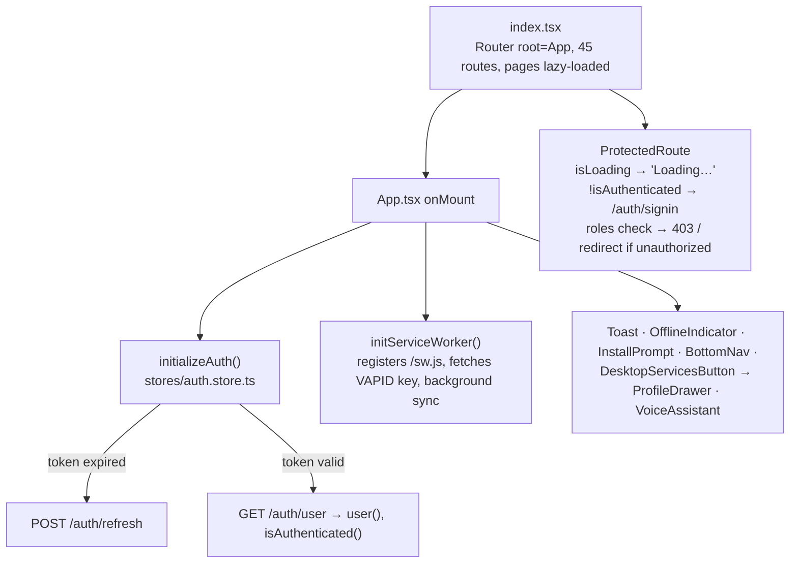
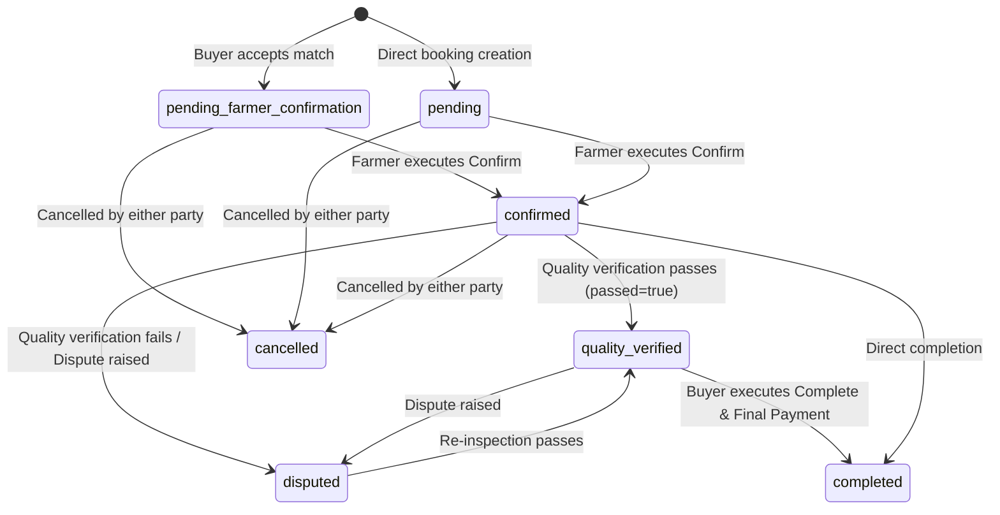
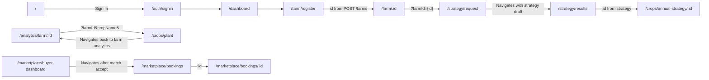

### CropSense AI — Frontend Specifications & Integration Reference (v2)
*Last updated: 2026-09-28 (branch feat/livestock-assistant-services-i18n).*

This document provides a comprehensive technical overview of the SolidJS application (`solidjs/src/`), detailing its architecture, route mappings, data contracts, inter-page state transitions, and resolved/remaining API integration gaps following backend synchronization.

For whole-system architecture and deployment details, see [ARCHITECTURE.md](ARCHITECTURE.md); for backend endpoints and schemas, see [BACKEND.md](BACKEND.md) / [BACKEND-v2.md](BACKEND-v2.md); for database tables and ORM mappings, see [DATA_MODEL.md](DATA_MODEL.md).

---

### Table of Contents
| Section | Covers |
| ------ | ------ |
| [1. Frontend Architecture](#1-frontend-architecture) | Boot, shell, API client transport, call patterns, browser storage, PWA & i18n |
| [2. Route Map](#2-route-map) | Complete 45-route mapping: page files, role guards, parameters, backend endpoints |
| [3. Data Contracts by Feature](#3-data-contracts-by-feature) | Request/response interfaces, payload structures, and error handling per domain |
| [4. Inter-Page Data Passing](#4-inter-page-data-passing) | Navigation flows, state handoffs, query params, and store-backed transfers |
| [5. Frontend ↔ Backend Integration Audit](#5-frontend--backend-integration-audit) | Status of P0/P1/P2/P3 fixes, updated contracts, and maintenance guidelines |

---

#### 1. Frontend Architecture
All paths are relative to `solidjs/src/` (frontend) and `python/app/` (backend). Backend endpoints are shown relative to `/api/v1/` unless noted.

##### 1.1 Boot and Shell Architecture

*   **ProtectedRoute Guard**: Enhanced to evaluate both authentication (`isAuthenticated()`) and user roles (`roles?: string[]`). Standard authenticated routes use `<ProtectedRoute>`, while privileged views (e.g., `/admin/analytics`, `/admin/quota`) enforce `<ProtectedRoute roles={['admin']}>`.
*   **Public Routes**: `/`, `/auth/signin`, `/auth/signup`, `/marketplace`, `/marketplace/:id`. All other routes require authentication.
*   **Route Precedence**: `@solidjs/router` prioritizes static segments over parameterized paths. For instance, `/marketplace/bookings` takes precedence over `/marketplace/:id`.
*   **Sign-Out & Cache Purging**: Executing `signOut()` in `auth.store.ts` purges all session state:
    *   Clears `apiClient` in-memory response cache.
    *   Wipes IndexedDB stores in `rural_farming_db`.
    *   Removes `assistant_chat` and session keys from `localStorage`.
    *   Posts a `CLEAR_API_CACHE` message to `sw.js` to clear cached `/api/*` GET responses.

##### 1.2 Transport Layer: `lib/api-client.ts`
| Aspect | Specification & Behavior |
| ------ | ------ |
| **Base URL** | `${VITE_API_URL}/api/v1` (falls back to `http://localhost:8000/api/v1`). Automatic deduplication for redundant `/api/v1` prefixes. |
| **Authentication** | Sends `Authorization: Bearer <access_token>` from `localStorage` unless `requiresAuth: false`. Uses Firebase ID tokens. |
| **Timeouts** | Default: 30s. Extended (90s): Sign-in, `/vision/diagnose-crop`, `/satellite/*`, and `/annual-strategy`. Returns HTTP 408 on timeout (non-retryable). |
| **Retry Strategy** | Up to 3 attempts (1s, 2s exponential backoff). Applies **only to idempotent HTTP methods (`GET`, `PUT`, `DELETE`)**. `POST` requests are non-retryable by default to prevent duplicate transactions. |
| **401 Handling** | Automatically attempts `POST /auth/refresh-token` with `{username, refresh_token}` and retries the original request once upon success. |
| **Response Cache** | In-memory cache for `GET` requests with a 5-minute TTL keyed by `method:url:body`. Shares in-flight requests for identical queries. Purged on sign-out. |

##### 1.3 Backend Interaction Patterns
| Pattern | Location | Generated Endpoint Pattern | Target Use Case |
| ------ | ------ | ------ | ------ |
| **Registry + Service** | `services/*.ts` using `buildUrl()` from `config/api-registry.json` | `/farms`, `/annual-strategy`, `/ai-quota/status/{id}` | Core business logic and custom domain endpoints |
| **Direct `apiClient`** | Page files (`ClimateHub.tsx`, `BuyerDashboard.tsx`, `MyListings.tsx`) | Explicit literal API path | Specialized views and direct component actions |
| **Generated `ModelService`** | `shared/Service/Services.ts` → `shared/Service/ModelService.ts` | `/islogin/<table>/` or `/isuper/<table>/` | Standard CRUD table access mapped to user ownership |

##### 1.4 Browser State & Persistent Storage
| Storage Type | Store / Key Name | Target Content | Maintenance Policy |
| ------ | ------ | ------ | ------ |
| **localStorage** | `access_token`, `id_token`, `refresh_token`, `username` | Authentication & token refresh state | Cleared on `signOut()` |
| **localStorage** | `user_data` | User profile cache (`id`, `user_type`, `language_preference`) | Updated via `/auth/user` or `PUT /users/profile` |
| **localStorage** | `app_lang` | Active UI language choice | Synced to backend via `PUT /users/profile` when user is logged in |
| **localStorage** | `app_config` (v3) | Dashboard layout toggles & optional form field flags | Managed via `/settings` configuration UI |
| **localStorage** | `assistant_chat` | Full-page AI Assistant dialogue history | Cleared on `signOut()` |
| **IndexedDB** | `rural_farming_db` | Offline mirrors of generated CRUD records | Cleared on `signOut()` |
| **Service Worker Cache** | `farming-platform-v1.1` | Static assets (cache-first), API GET requests (network-first) | Flushed via `CLEAR_API_CACHE` on `signOut()` |

##### 1.5 i18n and PWA Features
*   **Localization (i18n)**:
    *   `stores/i18n.store.ts` provides reactive `t(key)` translations across English (`en`), Hindi (`hi`), Marathi (`mr`), and Punjabi (`pa`).
    *   Language preference changes persist to `localStorage.app_lang` and automatically update the user account via `PUT /users/profile {language_preference}` when authenticated.
*   **Progressive Web App (PWA)**:
    *   Service worker (`public/sw.js`) dynamically retrieves the web push key from `GET /notifications/vapid-public-key` during initialization.
    *   Notification interactions open target paths defined in the push payload (`payload.url`).

---

#### 2. Route Map
**Guard Legend**: 🔓 Public | 🔒 `ProtectedRoute` (User) | 🛡️ `ProtectedRoute` (`roles=['admin']`)

##### 2.1 Core Shell, Authentication, and Account
| Route | Guard | Page File | Path Parameters / Queries | Backend Endpoints Called |
| ------ | ------ | ------ | ------ | ------ |
| `/` | 🔓 | `pages/Home.tsx` | – | `GET /analytics/profile-status` (if authenticated) |
| `/auth/signin` | 🔓 | `pages/auth/SignIn.tsx` | – | Firebase SDK, `POST /auth/google`, `GET /auth/user` |
| `/auth/signup` | 🔓 | `pages/auth/SignUp.tsx` | – | `POST /auth/signup`, `POST /auth/verify-email`, `GET /address/pincode/{pin}` |
| `/dashboard` | 🔒 | `pages/Dashboard.tsx` | – | `GET /analytics/profile-status`, `GET /livestock/`, `GET /livestock/farmer/{id}/portfolio`, `GET /predictive-analytics/predict-demand` |
| `/assistant` | 🔒 | `pages/Assistant.tsx` | `?q=`, `?mic=1` | `POST /voice/assist`, entity creation endpoints |
| `/menu` | 🔒 | `pages/AllServices.tsx` | – | None |
| `/settings` | 🔒 | `pages/Configuration.tsx` | – | None (`localStorage.app_config`) |
| `/users/profile` | 🔒 | `pages/users/Profile.tsx` | – | `GET /users/profile`, `PUT /users/profile` |
| `/users/security` | 🔒 | `pages/users/Security.tsx` | – | `GET /users/profile`, `POST /users/change-password`, `POST /users/me/mfa/enable` |
| `/notifications` | 🔒 | `pages/notifications/Notifications.tsx` | – | `GET /islogin/user_notification/`, `POST /notifications/{id}/read`, `POST /notifications/read-all` |
| `/quota/history` | 🔒 | `pages/quota/QuotaHistory.tsx` | – | `GET /ai-quota/status/{user.id}` |

##### 2.2 Farm, Plot, Crop, and Planning Operations
| Route | Guard | Page File | Path Parameters / Queries | Backend Endpoints Called |
| ------ | ------ | ------ | ------ | ------ |
| `/farm` | 🔒 | `pages/farm/Index.tsx` | – | `GET /farms` (standardized on `FarmService.getFarms()`) |
| `/farm/register` | 🔒 | `pages/farm/Register.tsx` | – | `POST /farms`, `GET /address/pincode/{pin}`, `GET /farms/location-lookup`, `GET /farms/soil-lookup/v2`, `GET /ai-quota/status/{user.id}` |
| `/farm/:id` | 🔒 | `pages/farm/FarmDashboard.tsx` | `:id` | `GET /farms/{id}`, `PUT /farms/{id}`, `DELETE /farms/{id}`, `GET /farms/{id}/plots`, `POST /farms/{id}/plots`, `GET /satellite/farm/{id}` |
| `/analytics/farm/:id` | 🔒 | `pages/farm/FarmAnalytics.tsx` | `:id` | `GET /analytics/farm/{id}`, `POST /crops/{cropId}/expenses`, `DELETE /islogin/crop/{cropId}` |
| `/plots/create` | 🔒 | `pages/plots/Create.tsx` | – | `GET /farms`, `POST /farms/{farm_id}/plots` (submits all plot attributes) |
| `/crops/plant` | 🔒 | `pages/crops/PlantCrop.tsx` | Form parameters | `POST /crops/quick-plant` |
| `/crops/my-crops` | 🔒 | `pages/crops/MyCrops.tsx` | – | `GET /crops/my-crops` |
| `/crops/annual-strategy/:id` | 🔒 | `pages/crops/AnnualStrategyDetail.tsx` | `:id` | `GET /annual-strategy/{id}` |
| `/diagnose` | 🔒 | `pages/crops/Diagnose.tsx` | – | `GET /crops/my-crops`, `GET /vision/diagnoses`, `POST /vision/diagnose-crop` |
| `/strategy/select-farm` | 🔒 | `pages/strategy/SelectFarm.tsx` | – | `GET /farms` |
| `/strategy/request` | 🔒 | `pages/strategy/Request.tsx` | `?farmId` | `GET /farms/{id}`, `GET /ai-quota/status/{user.id}`, `POST /annual-strategy` (returns draft `id`) |
| `/strategy/results` | 🔒 | `pages/strategy/Results.tsx` | `?farmId` | `GET /annual-strategy/list` (filtered by farm, routes using `strategy_id`/`id`) |

##### 2.3 Livestock, Climate, Soil, and Health Services
| Route | Guard | Page File | Path Parameters / Queries | Backend Endpoints Called |
| ------ | ------ | ------ | ------ | ------ |
| `/livestock` | 🔒 | `pages/livestock/PashuHome.tsx` | – | `GET /islogin/livestock/`, `GET /livestock-marketplace/listings`, `GET /veterinary/doctors` |
| `/livestock/hub` | 🔒 | `pages/livestock/LivestockHub.tsx` | – | `GET /islogin/livestock/`, `GET /vaccination-reminders` |
| `/livestock/diet-plan` | 🔒 | `pages/livestock/DietPlan.tsx` | – | Browser computation via `dietPlan.calculateDietPlan` |
| `/livestock/doctors` | 🔒 | `pages/livestock/VeterinaryDoctors.tsx` | – | `GET /veterinary/doctors`, `POST /veterinary/doctors` |
| `/climate/hub` | 🔒 | `pages/climate/ClimateHub.tsx` | – | `GET /farms`, `GET /weather/forecast`, `GET /severe-weather/alerts/active` |
| `/soil/hub` | 🔒 | `pages/soil/SoilFertilizerHub.tsx` | – | `GET /farms`, `GET /soil/health/plot/{id}`, `GET /soil-maps/*`, `GET /fertilizer-recommendations` |
| `/pest-disease/hub` | 🔒 | `pages/pest-disease/PestDiseaseHub.tsx` | – | `POST /pest-disease/identify`, `GET /pest-disease/treatments`, `GET /islogin/pest_disease_alert/` |
| `/services` | 🔒 | `pages/services/ServicesDirectory.tsx` | – | `GET /islogin/service/`, scoped provider/admin writes |

##### 2.4 Marketplace, Logistics, and Administration
| Route | Guard | Page File | Path Parameters / Queries | Backend Endpoints Called |
| ------ | ------ | ------ | ------ | ------ |
| `/marketplace` | 🔓 | `pages/marketplace/Browse.tsx` | Query filters | `GET /marketplace/listings` |
| `/marketplace/:id` | 🔓 | `pages/marketplace/Detail.tsx` | `:id` | `GET /marketplace/listings/{id}`, `POST /marketplace/buyer-interest` (prompts auth if guest) |
| `/marketplace/my-listings` | 🔒 | `pages/marketplace/MyListings.tsx` | – | `GET /marketplace/my-listings` |
| `/marketplace/buyer-dashboard` | 🔒 | `pages/marketplace/BuyerDashboard.tsx` | – | `apiClient.post('/supply-requests/')`, `accept-match`, `refresh-matches` |
| `/marketplace/bookings` | 🔒 | `pages/marketplace/Bookings.tsx` | Filters | `GET /marketplace/advance-bookings` |
| `/marketplace/bookings/:id` | 🔒 | `pages/marketplace/BookingDetails.tsx` | `:id` | `GET /marketplace/advance-bookings/{id}`, `confirm`, `quality-verify`, `payments`, `complete`, `cancel` |
| `/marketplace/intelligence` | 🔒 | `pages/marketplace/MarketIntelligence.tsx` | – | `GET /market-intelligence/trends/crop/{crop}`, `GET /predictive-analytics/opportunity-score` |
| `/marketplace/supply-planning` | 🔒 | `pages/marketplace/SupplyPlanning.tsx` | – | `GET /predictive-analytics/buyer-supply-planning`, `POST /predictive-analytics/predict-price` |
| `/livestock-marketplace` | 🔒 | `pages/livestock-marketplace/Browse.tsx` | Filters | `GET /livestock-marketplace/listings` |
| `/transport/tracking` | 🔒 | `pages/transport/TransportTracking.tsx` | – | `GET /transport/bookings` |
| `/admin/analytics` | 🛡️ | `pages/admin/PlatformAnalytics.tsx` | – | `GET /analytics/platform`, `GET /market-intelligence/summary` |
| `/admin/quota` | 🛡️ | `pages/admin/QuotaMonitoring.tsx` | – | `GET /ai-quota/statistics`, `POST /ai-quota/reset`, `PUT /ai-quota/limit/{id}` |

---

#### 3. Data Contracts by Feature

##### 3.1 Authentication & Profile Management
*   **Google / Firebase Sign-In**: `POST /auth/google`
    *   *Payload*: `{ id_token: string, refresh_token: string }`
    *   *Response*: `{ access_token: string, id_token: string, refresh_token: string, expires_in: number, user: { username: string, id: number, ... } }`
*   **Profile Update**: `PUT /users/profile`
    *   *Payload*: `{ full_name?: string, email?: string, phone_number?: string, language_preference?: string }`
    *   *Response*: `{ success: true, user: UserObject }`

##### 3.2 Marketplace & Advance Booking Workflow
Advance booking follows a strict state machine implemented in `services/booking_workflow.py` and supported by `BookingDetails.tsx`:

*   **Accept Match**: `POST /supply-requests/{rid}/accept-match`
    *   *Payload*: `{ match_id?: number, aggregation_group_id?: number }`
    *   *Response*: `{ booking_ids: number[], status: "pending_farmer_confirmation" }`
*   **Booking Details & Actions**:
    *   `POST /marketplace/advance-bookings/{id}/confirm` → transitions `pending_farmer_confirmation` or `pending` to `confirmed`.
    *   `POST /marketplace/advance-bookings/{id}/quality-verify` → `{ verifier_type: "farmer"|"buyer"|"third_party", quality_grade: string, passed: boolean, notes?: string, photos: string[] }`
    *   `POST /marketplace/advance-bookings/{id}/payments` → `{ milestone_type: "advance"|"quality_check"|"delivery"|"final", amount: number, transaction_ref: string }`

##### 3.3 Crop Diagnostics & Annual Strategy
*   **Vision Crop Diagnosis**: `POST /vision/diagnose-crop` (90s timeout)
    *   *Payload*: `{ image_base64: string, mime_type: string, crop_id?: number, crop_name?: string, lang: string }`
    *   *Response*: `{ id: number, diagnosis: { disease: string, severity: string, urgency: string, confidence: number, treatment: string, safety_guardrails: string[] } }`
*   **Generate Annual Strategy**: `POST /annual-strategy`
    *   *Payload*: `{ farm_id: number, budget_per_acre: number, previous_crops: string[], preferred_crop?: string }`
    *   *Response*: `{ id: number, farm_id: number, status: "draft", kharif: CropPlan, rabi: CropPlan, zaid: CropPlan, total_expected_profit: number }`

---

#### 4. Inter-Page Data Passing
Data transfer across views utilizes explicit URL route parameters, search query strings, reactive Solid stores (`farm.store`, `strategy.store`, `auth.store`), and `localStorage`:

---

#### 5. Frontend ↔ Backend Integration Audit

##### Verified Resolved Issues (P0–P3)
1.  **Admin Route Protection (P0)**: Added explicit `roles={['admin']}` checks in `ProtectedRoute.tsx` for `/admin/analytics` and `/admin/quota`.
2.  **Buyer Dashboard API Transport (P1)**: Standardized `BuyerDashboard.tsx` to use `apiClient.post('/supply-requests/...')` with dynamic `buyer_id: user().id`.
3.  **Booking Workflow Alignment (P1)**: Updated `booking_workflow.py` to allow `confirm` and `quality-verify` on `pending_farmer_confirmation` status, and implemented action UI controls in `BookingDetails.tsx`.
4.  **Annual Strategy Schema & Routing (P1)**: Aligned `schemas/crop.py` and `StrategyListItem` fields (`total_expected_profit`, `strategy_id`, `created_at`), enabling seamless navigation from `Results.tsx` to `AnnualStrategyDetail.tsx`.
5.  **Soil Hub Endpoint Alignment (P1)**: Fixed service endpoint URLs to target `/soil/health/plot/{id}`, `/soil-maps/*`, and `/fertilizer-recommendations`, with dynamic plot fetching on farm selection.
6.  **Pest Identification Integration (P1)**: Updated `PestDiseaseHub.tsx` to utilize `POST /pest-disease/identify` and `GET /pest-disease/treatments`.
7.  **Dynamic Quota Widget (P1)**: Replaced hardcoded `userId={1}` references across forms with `user()?.id`.
8.  **Sign-Out State Purging (P0)**: Configured `auth.store.ts` to clear in-memory API caches, IndexedDB, localStorage chat logs, and service worker caches upon sign-out.
9.  **Idempotent Retry Policy (P2)**: Restricted automatic `apiClient` retries to `GET`, `PUT`, and `DELETE` requests.
10. **Farm Data Model Standardization (P3)**: Standardized frontend views to consume `/farms` (`FarmService.getFarms()`).

---
